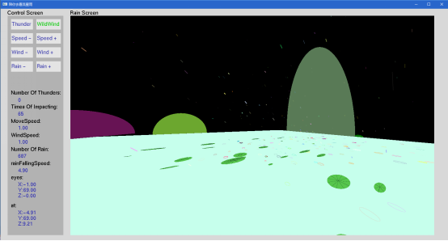

# rain_bow

`rain_bow` is a kind of graphic program coded by `C99`, built on VS 2015, with a graphic library `openGL`. What it shows is a funny sceen simulating colorful and dynamical rainfall. Besides, user could adjust the wind-force and take a 3D-walk, hearing the sounds of thunder and rains.

## Feature

- Raindrops falling randomly
- Number of raindrops adjustable
- Ripples visiable
- Colorful Raindrops
- 3D-Walk
- Sounds effect support

## Platform

This program was built on `Win 10 x86_64`, and the project was built by `VS 2015`, project file named `rain_bow.sln` is under / .

## Screenshot

### Main window

### Thunder

